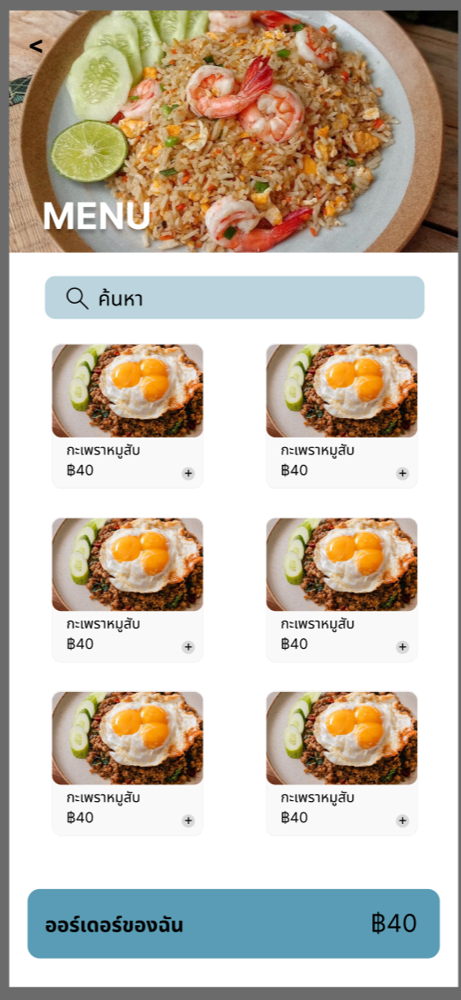

# 🍱 P'Chaa-ng Food Ordering System

A cross-platform food ordering and queue management system between customers and restaurant staff.

## 📱 Project Overview

Solves the complexity of variable food customizations and daily queue management.It provides two distinct experiences:

- **Customer Side:** For real-time ordering, scheduled pickups, and live queue tracking.
- **Owner Side:** For dynamic menu management and order fulfillment.

## Project Prototype

## 🛠 Tech Stack

- **Frontend:** Flutter (Mobile & Maybe Web)
- **Database:** PostgreSQL (Relational data + JSONB for flexible add-ons)
- **Storage:** MinIO (Food & Profile images)
- **Backend:** Severpod

## 🏗 System Architecture

The app logic centers around a flexible JSON-based customization engine and an automated daily resetting queue.

### Key Modules:

- **Customization Engine:** Handles complex "Pick-one" or "Pick-many" add-ons for menu items.
- **Hybrid Queue System:** Manages two distinct tracks—**I** (Immediate) and **S** (Scheduled).
- **Global Operations:** Real-time shop status control (Open/Close) and operational hours.

## 📊 Database Design (Brief)

The system relies on a **PostgreSQL** schema optimized for data integrity and snapshotting:

1. **`store_settings`**: Global store hours and manual toggle.
2. **`menu_items`**: Base products with flexible JSONB customization schemas.
3. **`carts` & `orders**`: Dynamic pricing and state management.
4. **`daily_queue_counters`**: Automated daily reset logic for queue numbering.

## 📊 Developed by:

**66070092** | **66070148** | **66070245**
