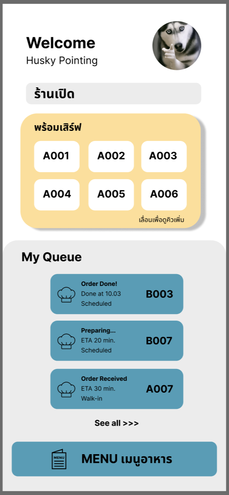
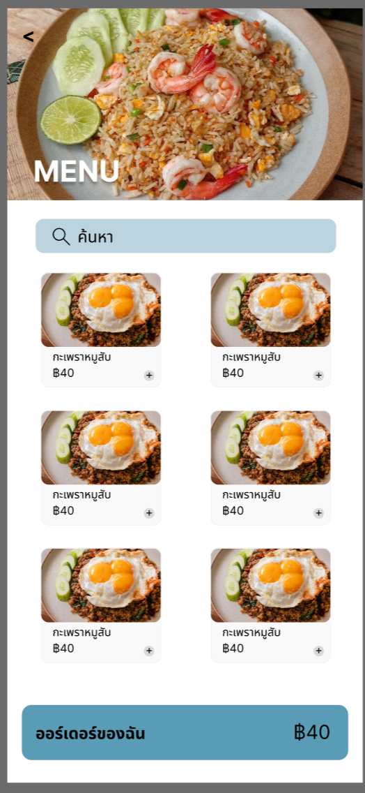
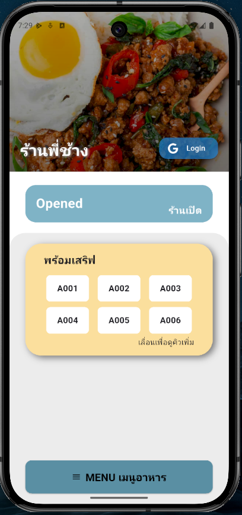
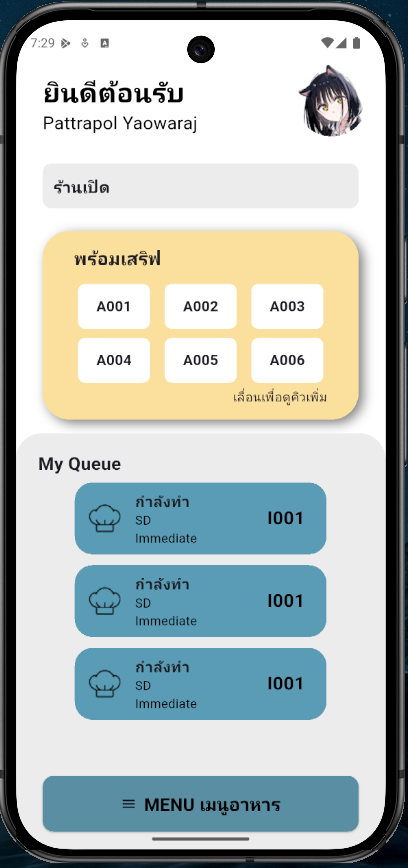
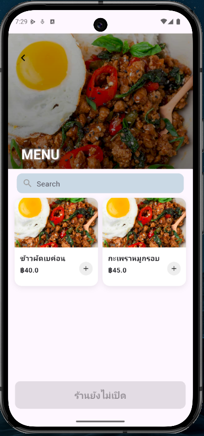

# 🍱 P'Chaa-ng Food Ordering System

A cross-platform food ordering and queue management system between customers and restaurant staff.

## � Prerequisites

Before starting, ensure your system has the following installed:

1. **[Flutter SDK](https://docs.flutter.dev/get-started/install)** (For compiling the frontend app)
2. **[Dart SDK](https://dart.dev/get-dart)** (Usually bundled with Flutter, required for the backend)
3. **[Docker Desktop](https://www.docker.com/products/docker-desktop/)** (Used to automatically containerize the PostgreSQL database and Redis)
4. **Serverpod CLI** (Required to generate schema models and endpoints)
   ```bash
   dart pub global activate serverpod_cli 3.1.1
   ```

## 🚀 Installation & Setup

### Option 1: Quick Start (Recommended)
You can build and start the entire stack (Database, Backend, and Frontend) automatically using the provided scripts.

**For Windows (PowerShell):**
```powershell
./start.ps1
```

**For macOS/Linux (Bash):**
```bash
chmod +x start.sh
./start.sh
```
*Note: This script will fetch all dependencies, generate Serverpod models, spin up Docker, apply DB migrations, and launch both the server and Flutter app in separate terminals.*

---

### Option 2: Manual Installation

If you prefer to start the services manually, follow these steps:

#### 1. Fetch Dependencies
Install packages for all three layers:
```bash
cd pchaa_client && dart pub get
cd ../pchaa_server && dart pub get
cd ../pchaa_flutter && flutter pub get
```

#### 2. Generate Serverpod Models
Generate the schema and client files from the backend:
```bash
cd pchaa_server
serverpod generate
```

#### 3. Start the Database (Docker)
Start PostgreSQL and Redis via Docker Compose:
```bash
# Still inside pchaa_server
docker compose up -d
```

#### 4. Run database migrations & Start Backend
Apply the database schemas and start the Dart server:
```bash
dart bin/main.dart --apply-migrations
dart bin/main.dart
```

#### 5. Start the Application
Open a **new terminal**, navigate to the Flutter project, and run:
```bash
cd pchaa_flutter
flutter run
```

## 📱 Project Overview

Solves the complexity of variable food customizations and daily queue management.It provides two distinct experiences:

- **Customer Side:** For real-time ordering, scheduled pickups, and live queue tracking.
- **Owner Side:** For dynamic menu management and order fulfillment.

## Project Prototype




## Sprint 1 Result





## 🛠 Tech Stack

- **Frontend:** Flutter (Mobile)
- **Database:** PostgreSQL (Relational data + JSONB for flexible add-ons)
- **Storage:** MinIO (Food images)
- **Backend:** Severpod

## 🏗 System Architecture

The app logic centers around a flexible JSON-based customization engine and an automated daily resetting queue.

### Key Modules:

- **Customization Engine:** Handles complex "Pick-one" or "Pick-many" add-ons for menu items.
- **Hybrid Queue System:** Manages two distinct tracks—**I** (Immediate) and **S** (Scheduled).
- **Global Operations:** Real-time shop status control (Open/Close) and operational hours.

## 📊 Database Design (Brief)

The system relies on a **PostgreSQL** schema optimized for data integrity and snapshotting:

1. **`store_settings`**: Global store hours and manual toggle.
2. **`menu_items`**: Base products with flexible JSONB customization schemas.
3. **`carts` & `orders`**: Dynamic pricing and state management.
4. **`daily_queue_counters`**: Automated daily reset logic for queue numbering.

## 📊 Developed by:

**66070092** | **66070148** | **66070245**
